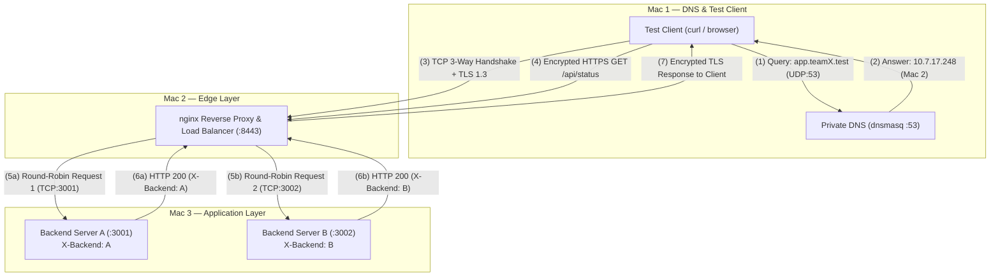

# Private Network Service Platform

A bare-metal, multi-tier distributed network service platform deployed across a physical Local Area Network (LAN) using macOS nodes. This project demonstrates core computer networking principles including **Private DNS Resolution**, **Transport Layer Handshakes (TCP)**, **Cryptographic Session Negotiation (TLS 1.2/1.3)**, **Layer 7 Reverse Proxying & Load Balancing**, and **HTTP Caching**.

---

## 📑 Table of Contents

- [1. Architectural Overview](#1-architectural-overview)
- [2. Multi-Node Deployment & Role Matrix](#2-multi-node-deployment--role-matrix)
- [3. Network Topology](#3-network-topology)
- [4. Protocol Stack & Port Allocation](#4-protocol-stack--port-allocation)
- [5. End-to-End Request Lifecycle](#5-end-to-end-request-lifecycle)
- [6. Key Architectural Principles](#6-key-architectural-principles)
- [7. Project Structure](#7-project-structure)
- [8. Setup & Deployment Guide](#8-setup--deployment-guide)
  - [Mac 1: Private DNS & Test Client](#mac-1-private-dns--test-client)
  - [Mac 2: Edge Reverse Proxy & TLS Ingress](#mac-2-edge-reverse-proxy--tls-ingress)
  - [Mac 3: Dual Backend Microservices](#mac-3-dual-backend-microservices)
- [9. Verification & Testing Playbook](#9-verification--testing-playbook)
- [10. Protocol Capture & Evidence Catalog](#10-protocol-capture--evidence-catalog)
- [11. Troubleshooting](#11-troubleshooting)

---

## 1. Architectural Overview

The platform partitions standard web service infrastructure across three dedicated physical machines connected to a flat LAN subnet:

```
  ┌─────────────────────────────────────────────────────────────────────────┐
  │                         Shared Local Area Network                       │
  └─────────────────────────────────────────────────────────────────────────┘
          │                                  │                     │
          ▼                                  ▼                     ▼
┌──────────────────┐               ┌──────────────────┐  ┌──────────────────┐
│      Mac 1       │               │      Mac 2       │  │      Mac 3       │
│  (10.7.x.x)      │               │  (10.7.17.248)   │  │  (10.7.19.140)   │
├──────────────────┤               ├──────────────────┤  ├──────────────────┤
│ • Private DNS    │  (1) UDP 53   │ • Nginx Ingress  │  │ • Backend A      │
│   (dnsmasq)      │──────────────>│ • TLS 1.3 Term.  │  │   (Node.js :3001)│
│ • Test Client    │  (2) TCP 8443 │ • Round-Robin    │  │ • Backend B      │
│   (curl/browser) │──────────────>│   Load Balancer  │  │   (Node.js :3002)│
└──────────────────┘               └─────────┬────────┘  └────────▲─────────┘
                                             │ (3) HTTP Forward   │
                                             └────────────────────┘
```

1. **Private Name Resolution**: Mac 1 hosts a lightweight `dnsmasq` instance routing `.test` domains directly to the Edge Proxy (Mac 2), preserving normal public internet resolution via upstream forwarders.
2. **Secure Edge Ingress**: Mac 2 acts as a single edge gateway running `nginx`. It terminates TLS over port `8443` using locally trusted X.509 PKI certificates.
3. **Layer 7 Load Balancing**: Ingress traffic is balanced across two isolated upstream Node.js services hosted on Mac 3 (`:3001` and `:3002`) using a Round-Robin algorithm.
4. **Header Passthrough & Caching**: Backend services inject identification headers (`X-Backend: A` / `X-Backend: B`) and caching directives (`Cache-Control: public, max-age=60`), which the reverse proxy passes downstream intact.

---

## 2. Multi-Node Deployment & Role Matrix

| Node | Machine Role | Core Software / Runtimes | Network Interfaces & Ports | Description |
| :--- | :--- | :--- | :--- | :--- |
| **Mac 1** | • Private DNS Server<br>• Client Node | `dnsmasq`, `curl`, `dig`, `nslookup` | `en0` / UDP `53`<br>Outbound TCP Client | Authoritative resolver for project domain `app.teamX.test`; executes validation requests. |
| **Mac 2** | • Edge Ingress Proxy<br>• TLS Terminator<br>• Load Balancer | `nginx` (Homebrew) | `en0` (e.g. `10.7.17.248`)<br>TCP `8443` (TLS)<br>TCP `8080` (HTTP Redirect) | LAN edge gateway terminating TLS and proxying requests to Mac 3. |
| **Mac 3** | • Upstream Backend A<br>• Upstream Backend B | Node.js, Express.js | `en0` (e.g. `10.7.19.140`)<br>TCP `3001` (Backend A)<br>TCP `3002` (Backend B) | Independent application instances executing business logic and response generation. |

---

## 3. Network Topology



---

## 4. Protocol Stack & Port Allocation

### Protocol Breakdown by OSI Layer

| Protocol | OSI Layer | Transport | Port | Scope & Purpose |
| :--- | :--- | :--- | :--- | :--- |
| **DNS** | Application (L7) | UDP | `53` | Translates `app.teamX.test` and `api.teamX.test` to Mac 2's LAN IP without broadcast pollution. |
| **TCP** | Transport (L4) | IP | Dynamic | Connection-oriented, ordered byte-stream delivery with flow control and retransmissions. |
| **TLS 1.2 / 1.3** | Presentation / Session (L6/L5) | TCP | `8443` | Cryptographic session establishment, mutual parameter exchange (ECDHE), and symmetric cipher encryption (AES-GCM). |
| **HTTPS** | Application (L7) | TLS/TCP | `8443` | Secure application payload transfer between Client and Nginx edge. |
| **HTTP / 1.1** | Application (L7) | TCP | `3001`, `3002` | Internal unencrypted communication between Edge Proxy and Upstream Backends. |

### Port Allocation Table

| Service | Target Machine | Port | Transport | Privilege Level | Notes |
| :--- | :--- | :--- | :--- | :--- | :--- |
| `dnsmasq` | Mac 1 | `53` | UDP | `sudo` / Root | Standard DNS listening port on macOS. |
| `nginx` (HTTPS) | Mac 2 | `8443` | TCP | Non-root | High-port TLS ingress avoiding macOS privileged port restrictions. |
| `nginx` (HTTP Redirect)| Mac 2 | `8080` | TCP | Non-root | 301 Permanent Redirect to HTTPS port. |
| Backend Instance A | Mac 3 | `3001` | TCP | User space | Node.js Express server (`0.0.0.0:3001`). |
| Backend Instance B | Mac 3 | `3002` | TCP | User space | Node.js Express server (`0.0.0.0:3002`). |

---

## 5. End-to-End Request Lifecycle

```
Client (Mac 1)            DNS (Mac 1:53)          Edge / Nginx (Mac 2)     Backend A/B (Mac 3)
     |                          |                          |                       |
     |--- (1) DNS Query ------->|                          |                       |
     |    app.teamX.test (A)    |                          |                       |
     |                          |                          |                       |
     |<-- (2) DNS Answer -------|                          |                       |
     |    IP: MAC2_IP           |                          |                       |
     |                                                     |                       |
     |--- (3) TCP SYN ------------------------------------>|                       |
     |<-- (3) TCP SYN-ACK ---------------------------------|                       |
     |--- (3) TCP ACK ------------------------------------>|                       |
     |                                                     |                       |
     |<=> (4) TLS Handshake (ClientHello / ServerHello) <=>|                       |
     |    (Key Exchange, Certificate Verification)         |                       |
     |                                                     |                       |
     |--- (5) HTTPS Request (Encrypted GET /api/status) -->|                       |
     |                                                     |                       |
     |                                                     |-- (6) Forward HTTP -->|
     |                                                     |   (Round Robin :3001  |
     |                                                     |    or :3002)          |
     |                                                     |                       |
     |                                                     |<- (7) HTTP Response --|
     |                                                     |   (X-Backend: A or B) |
     |                                                     |                       |
     |<-- (8) HTTPS Encrypted Response --------------------|                       |
```

1. **DNS Resolution**: Client queries Mac 1 on UDP port 53. `dnsmasq` evaluates local address rules and returns `MAC2_IP`.
2. **TCP 3-Way Handshake**: Client initiates a connection to `MAC2_IP:8443` exchanging `SYN` $\rightarrow$ `SYN-ACK` $\rightarrow$ `ACK`.
3. **TLS Session Negotiation**: Over the TCP socket, the client issues `ClientHello` with SNI `app.teamX.test`. Nginx responds with `ServerHello` and its certificate. The client verifies the certificate against its local trusted CA and completes key exchange.
4. **Ingress Decryption & Upstream Routing**: Nginx receives encrypted HTTP data, terminates TLS, and selects an upstream backend according to Round-Robin distribution.
5. **Backend Processing**: Node.js processes the route, adds `X-Backend: A` (or `B`) and `Cache-Control: public, max-age=60`, returning HTTP 200 OK.
6. **Encrypted Egress Delivery**: Nginx encrypts the HTTP response within the TLS tunnel and dispatches it over TCP to the client.

---

## 6. Key Architectural Principles

- **No Insecure Bypasses (`curl -k` Forbidden)**: The platform implements full PKI chain verification. Local root CAs generated via `mkcert` are installed in the macOS system trust store, ensuring strict cryptographic verification with zero SSL warnings.
- **Isolated Upstream Topology**: Client nodes are strictly isolated from backend ports (`3001`, `3002`). Backend applications only bind to internal interfaces and are shielded behind the reverse proxy.
- **RFC 6761 Compliant Namespace**: Uses the reserved `.test` Top-Level Domain (TLD) to avoid collisions with macOS mDNS (`.local`) and live internet registries.
- **Stateless Layer 7 Distribution**: Round-Robin scheduling balances load evenly between backend microservices without sticky sessions, providing predictable horizontal scalability.

---

## 7. Project Structure

```
.
├── README.md                          # Root Project Documentation (This file)
├── architecture/                      # Architecture Specifications & Design Documents
│   ├── ip-service-table.md            # Host IP, Interface, MAC & Port mapping table
│   ├── phase-1-requirements.md        # Requirement gates & verification checklists
│   ├── request-flow.md                # Protocol flow specifications & sequence diagrams
│   └── topology.md                    # 3-Machine network topology details
├── backend/                           # Upstream Backend Microservices
│   ├── backend-a/                     # Node.js Service A (Port 3001, Header: X-Backend: A)
│   │   ├── package.json
│   │   └── server.js
│   └── backend-b/                     # Node.js Service B (Port 3002, Header: X-Backend: B)
│       ├── package.json
│       └── server.js
├── config/                            # Infrastructure Configuration Files
│   ├── README.md                      # Detailed config setup instructions
│   ├── dnsmasq.conf                   # Private DNS daemon configuration
│   ├── nginx.conf                     # Reverse proxy, TLS & Upstream load balancer config
│   └── tls-setup.md                   # Step-by-step local CA & PKI generation guide
└── evidence/                          # Network Packet Captures & Verification Artifacts
    ├── backend/                       # Direct backend HTTP proof (Backend-A, Backend-B)
    ├── caching/                       # HTTP Cache-Control header verification
    ├── dns/                           # DNS query/response Wireshark capture
    ├── load-balancing/                # Round-robin distribution request alternating proof
    ├── tcp/                           # TCP 3-Way Handshake SYN/SYN-ACK/ACK capture
    └── tls/                           # TLS 1.3 ClientHello, Handshake & Application Data captures
```

---

## 8. Setup & Deployment Guide

### Prerequisites

- **macOS** on all 3 nodes connected to the same Wi-Fi / Ethernet LAN.
- **Homebrew** package manager installed.
- **Node.js** (v18+) installed on Mac 3.

---

### Mac 1: Private DNS & Test Client

1. **Install dnsmasq**:
   ```bash
   brew install dnsmasq
   ```

2. **Configure DNS Records**:
   Edit `config/dnsmasq.conf` and update the IP addresses with Mac 2's LAN IP:
   ```conf
   address=/app.teamX.test/10.7.17.248
   address=/api.teamX.test/10.7.17.248
   ```

3. **Start dnsmasq** (runs on privileged port 53):
   ```bash
   sudo dnsmasq -C /path/to/computer-network-project/config/dnsmasq.conf -d
   ```

4. **Configure Mac 1 DNS Resolver**:
   ```bash
   sudo networksetup -setdnsservers Wi-Fi 127.0.0.1
   ```

---

### Mac 2: Edge Reverse Proxy & TLS Ingress

1. **Install nginx & mkcert**:
   ```bash
   brew install nginx mkcert nss
   ```

2. **Generate TLS Certificates**:
   ```bash
   # Initialize local Root CA
   mkcert -install

   # Generate certificate for the project domains
   mkcert app.teamX.test api.teamX.test

   # Place certificate and key in nginx directory
   mkdir -p /opt/homebrew/etc/nginx/certs
   mv app.teamX.test*.pem /opt/homebrew/etc/nginx/certs/
   chmod 600 /opt/homebrew/etc/nginx/certs/app.teamX.test-key.pem
   ```

3. **Install Root CA on Client Nodes (Mac 1 & Mac 3)**:
   - Export root CA from Mac 2: `mkcert -CAROOT` (`rootCA.pem`).
   - Copy `rootCA.pem` to Mac 1 and Mac 3.
   - Trust CA on client:
     ```bash
     sudo security add-trusted-cert -d -r trustRoot -k /Library/Keychains/System.keychain rootCA.pem
     ```

4. **Deploy nginx Configuration**:
   - Update `config/nginx.conf` upstream block with Mac 3's LAN IP:
     ```nginx
     upstream backend_servers {
         server 10.7.19.140:3001;   # Backend A
         server 10.7.19.140:3002;   # Backend B
     }
     ```
   - Copy configuration and start nginx:
     ```bash
     cp config/nginx.conf /opt/homebrew/etc/nginx/nginx.conf
     nginx -t
     nginx
     ```

---

### Mac 3: Dual Backend Microservices

1. **Start Backend Server A** (Port `3001`):
   ```bash
   cd backend/backend-a
   npm install
   npm start
   ```

2. **Start Backend Server B** (Port `3002`):
   ```bash
   cd backend/backend-b
   npm install
   npm start
   ```

---

## 9. Verification & Testing Playbook

Execute these commands from **Mac 1** (Client Node) to validate the end-to-end network deployment:

### 1. DNS Resolution Validation

```bash
dig @127.0.0.1 app.teamX.test
```
*Expected Result:* `ANSWER SECTION` returns Mac 2's IP (`10.7.17.248`).

---

### 2. Strict TLS & HTTPS Verification (No `-k` Flag)

```bash
curl -i https://app.teamX.test:8443/api/status
```
*Expected Result:*
```http
HTTP/2 200 
x-backend: A
cache-control: public, max-age=60
content-type: application/json; charset=utf-8

{"backend":"A","status":"ok"}
```
> **Notice:** Request must complete without any SSL certificate error or insecure warning.

---

### 3. Round-Robin Load Balancing Verification

Execute 4 sequential requests to verify alternating backend routing:

```bash
for i in {1..4}; do
  echo "--- Request $i ---"
  curl -s -I https://app.teamX.test:8443/api/status | grep -i "x-backend"
done
```

*Expected Result:*
```
--- Request 1 ---
x-backend: A
--- Request 2 ---
x-backend: B
--- Request 3 ---
x-backend: A
--- Request 4 ---
x-backend: B
```

---

### 4. HTTP Caching Headers Verification

```bash
curl -I https://app.teamX.test:8443/api/status | grep -i "cache-control"
```
*Expected Result:* `Cache-Control: public, max-age=60`

---

## 10. Protocol Capture & Evidence Catalog

The [`evidence/`](evidence/) directory contains packet captures and screenshots taken during live test executions:

| Category | Evidence File | Verified Protocol Concept |
| :--- | :--- | :--- |
| **DNS** | [`evidence/dns/DNS-Captured.jpg`](evidence/dns/DNS-Captured.jpg) | UDP Port 53 DNS query for `app.teamX.test` and A record resolution. |
| **TCP** | [`evidence/tcp/tcp-three-way-handshake.jpg`](evidence/tcp/tcp-three-way-handshake.jpg) | Standard 3-Way Handshake (`SYN` $\rightarrow$ `SYN-ACK` $\rightarrow$ `ACK`) on port `8443`. |
| **TLS** | [`evidence/tls/tls-client-hello.jpg`](evidence/tls/tls-client-hello.jpg) | TLS `ClientHello` frame with SNI `app.teamX.test` and cipher suite proposals. |
| **TLS** | [`evidence/tls/TLS-overview.jpg`](evidence/tls/TLS-overview.jpg) | Complete TLS cryptographic exchange overview and certificate validation. |
| **TLS** | [`evidence/tls/tls-encrypted-application-data.jpg`](evidence/tls/tls-encrypted-application-data.jpg) | Encrypted Application Data frames protecting HTTP payloads over the wire. |
| **Load Balancing**| [`evidence/load-balancing/Load-balancing .jpg`](evidence/load-balancing/Load-balancing%20.jpg) | Alternating `X-Backend: A` and `X-Backend: B` headers via Nginx Round-Robin. |
| **Backend Services**| [`evidence/backend/Backend-A.jpg`](evidence/backend/Backend-A.jpg)<br>[`evidence/backend/Backend-B.jpg`](evidence/backend/Backend-B.jpg) | Direct isolated Node.js instance execution on ports `3001` and `3002`. |
| **HTTP Caching** | [`evidence/caching/http-cache-headers.jpg`](evidence/caching/http-cache-headers.jpg) | `Cache-Control` header passthrough at the reverse proxy layer. |

---

## 11. Troubleshooting

| Symptom | Probable Cause | Diagnostic / Remediation Step |
| :--- | :--- | :--- |
| `dig` returns `NXDOMAIN` | `dnsmasq` is not running or domain record is misspelled. | Run `sudo dnsmasq -C config/dnsmasq.conf -d` and inspect query logs. |
| `curl: (60) SSL certificate problem` | Client machine trust store does not contain the Root CA. | Export `rootCA.pem` from Mac 2 and run `sudo security add-trusted-cert ...`. |
| `curl: (7) Failed to connect` | `nginx` is not running or macOS firewall is blocking port 8443. | Run `sudo lsof -i :8443` on Mac 2 to confirm listening state; check firewall settings. |
| `HTTP 502 Bad Gateway` | Upstream Node.js instances are stopped or IP mismatch in `nginx.conf`. | Verify `MAC3_IP` in `nginx.conf` and test `curl http://MAC3_IP:3001/` from Mac 2. |
| No `X-Backend` alternation | Only one backend server is active on Mac 3. | Confirm both `node server.js` processes are active on ports `3001` and `3002`. |

---
