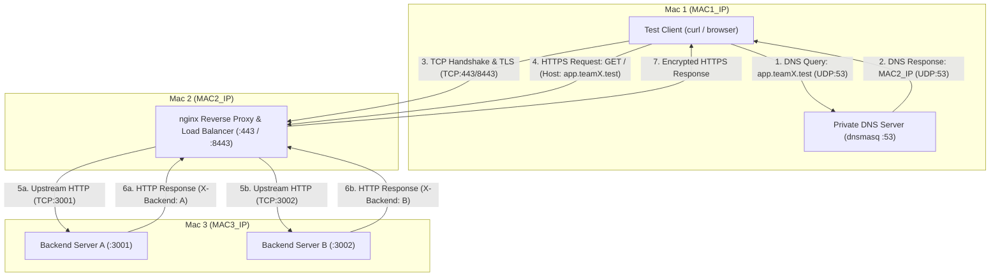

# Private Network Service Platform — Network Topology

## 1. Project Architecture Overview

The **Private Network Service Platform** is a multi-tier private network architecture deployed across a local area network (LAN). The system demonstrates core computer networking concepts—including private DNS resolution, transport layer connection establishment, cryptographic session negotiation (TLS), layer 7 reverse proxying and load balancing, and backend service decoupling.

The system is deployed across **three macOS machines** connected to the same physical/wireless local area network.

---

## 2. 3-Mac Architecture & Machine Roles

| Machine | Assigned Roles | Core Software / Services | Primary Network Function |
| :--- | :--- | :--- | :--- |
| **Mac 1** | • Private DNS Server<br>• Test Client | `dnsmasq`, `dig`, `nslookup`, `curl` | Resolves domain names for the `.test` zone to the edge proxy; initiates test queries and client HTTP requests. |
| **Mac 2** | • Edge / Reverse Proxy<br>• Load Balancer | `nginx` | Serves as the single public entry point on the LAN, terminates TLS, and distributes traffic between backend services. |
| **Mac 3** | • Backend Server A<br>• Backend Server B | Node.js runtime (`Backend A: 3001`, `Backend B: 3002`) | Executes backend application logic and handles proxied requests. Both instances reside on the same host but listen on distinct TCP ports. |

> **Note:** IP addresses throughout this architecture are placeholders (`MAC1_IP`, `MAC2_IP`, `MAC3_IP`) and will be updated once active network interfaces are assigned on the test LAN.

---

## 3. Network Topology Diagram

```
                              +------------------------------------------+
                              |         Private LAN (Flat Subnet)        |
                              +------------------------------------------+
                                     |             |              |
                    +----------------+             |              +----------------+
                    |                              |                               |
                    v                              v                               v
         +--------------------+         +--------------------+          +--------------------+
         |       Mac 1        |         |       Mac 2        |          |       Mac 3        |
         |      (MAC1_IP)     |         |      (MAC2_IP)     |          |      (MAC3_IP)     |
         +--------------------+         +--------------------+          +--------------------+
         | • Private DNS      |         | • Edge Proxy       |          | • Backend A        |
         |   (dnsmasq :53)    |         |   (nginx)          |          |   (Node.js :3001)  |
         | • Test Client      |         | • TLS Termination  |          | • Backend B        |
         |   (dig / curl)     |         |   (:443 / :8443)   |          |   (Node.js :3002)  |
         +--------------------+         | • Load Balancer    |          +--------------------+
                    |                   +--------------------+                     ^
                    |                              ^                               |
                    | (1) DNS Query (UDP 53)       |                               |
                    +------------------------------+                               |
                    |                                                              |
                    | (2) HTTPS Request (TCP 443/8443)                             |
                    +--------------------------------------------------------------+
                                                   |
                                                   | (3) Proxied HTTP (TCP 3001/3002)
                                                   +-------------------------------+
```

### Mermaid Diagram



---

## 4. Logical Connections and Request Path

The full logical communication path follows these stages:

1. **DNS Resolution Stage (Mac 1 <-> Mac 1 / Local LAN)**
   - The test client issues a standard DNS lookup for domain `app.teamX.test` or `api.teamX.test` to the DNS resolver on Mac 1 (listening on `MAC1_IP:53` via UDP).
   - `dnsmasq` responds with the A record pointing to the Edge Proxy IP (`MAC2_IP`).

2. **Edge Ingress Stage (Mac 1 <-> Mac 2)**
   - The client initiates an IP/TCP connection to `MAC2_IP` on port `443` (or `8443` if unprivileged ports are required on macOS).
   - A TLS handshake is negotiated directly between the client and `nginx` on Mac 2.
   - The client transmits an encrypted HTTP request (e.g., `GET /` or `GET /api/status`).

3. **Reverse Proxying & Upstream Forwarding (Mac 2 <-> Mac 3)**
   - `nginx` decrypts the incoming TLS request and evaluates the upstream pool configuration.
   - Using Round-Robin load balancing, `nginx` forwards the HTTP request over internal TCP connections to either:
     - `MAC3_IP:3001` (Backend Server A), or
     - `MAC3_IP:3002` (Backend Server B).
   - The chosen backend processes the request and injects an identification header (`X-Backend: A` or `X-Backend: B`).

4. **Response Egress (Mac 3 -> Mac 2 -> Mac 1)**
   - The backend returns the raw HTTP response to `nginx`.
   - `nginx` applies any edge caching headers, encrypts the payload via TLS, and sends the HTTPS response back to the client on Mac 1.

---

## 5. Architectural Design Rationale: Edge Proxy vs. Direct Backend Access

In this architecture, clients **never communicate directly with backend servers**. All interactions are mediated through `nginx` on Mac 2. This design provides several fundamental network and security benefits:

1. **Single Public Surface / Ingress Control**
   - Backend servers (Mac 3) do not expose public TLS certificates or multiple ports directly to clients. Clients only need to know a single domain name and single entry point (`MAC2_IP`).

2. **Centralized TLS Termination**
   - Managing cryptographic keys, certificates, cipher suites, and TLS versions is centralized at the reverse proxy. Backend nodes remain lightweight HTTP services without the computational and administrative overhead of per-service TLS management.

3. **Load Distribution & High Availability**
   - Direct client-to-backend binding creates tight coupling and single points of failure. The reverse proxy distributes traffic across available backend instances (Round-Robin) and allows backend scaling or maintenance without client reconfiguration.

4. **Network Isolation and Security Decoupling**
   - By isolating backend ports (`3001`, `3002`) behind the proxy, backend topology changes (moving a service, adding instances, altering ports) are completely transparent to end clients.

5. **Uniform Policy Enforcement**
   - Caching headers (`Cache-Control`, `ETag`), response header injection, rate limiting, and access logging are enforced uniformly at the edge layer.
